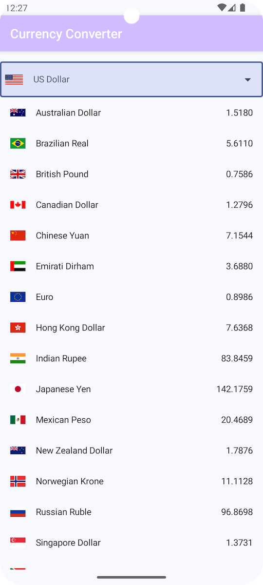

# Currency Convert

This is a sample project which demos a good Android app architecture using Kotlin flows and Compose. It also have view implementation. Use `MainActivity.USE_COMPOSE` to switch between compose and view.

## Architecture components

* Unidirectional flow: The data flows using `StateFlow` from database and network
* MVVM: MVVM pattern is applied. There are different data models for conversions.
* Hilt Dependency Injection: Dependency injection is done using Hilt so that unit testing various components is easy
* Room database: For local storage so that data is available at cold starts.
* Compose: UI is built using Compose.
* SharedPreference: Current currency is stored in SharedPreference. It can be stored in database too but using this approach it is demonstrated on how to use multiple data sources in repositories. 

## Unit testing

1. `MainViewModel` is unit tested (more to come..)

## Screenshot

